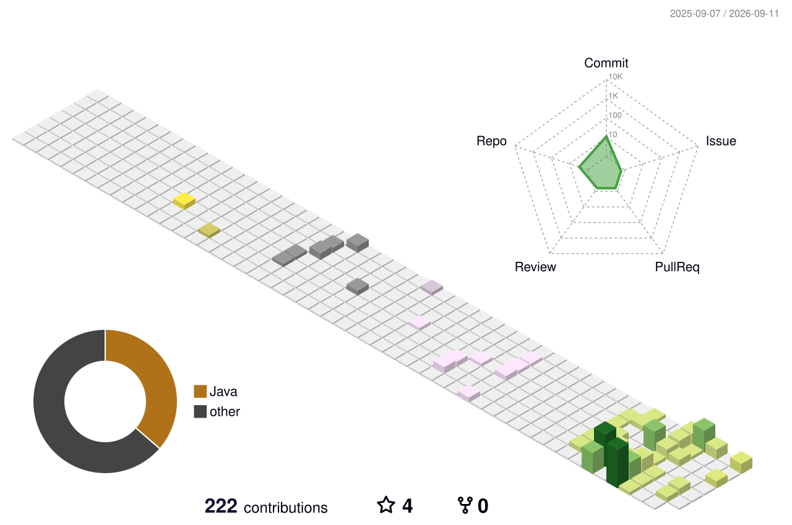

  
<!-- Teknoloji ikonlari -->

  

 

---

## 🇹🇷 Merhaba, ben Esad Özkan

**Bilgisayar Mühendisliği öğrencisiyim** — odağım **Siber Güvenlik alanında Blue Team**.

Sistemleri analiz ediyor, savunuyor ve süreci okuyor, öğreniyor ve yazıyorum. Lisansımı bitirirken güvenlik
araçları ve uygulamalı lab çalışmalarından oluşan public bir portföy inşa ediyorum.

- 🛡️ **Odak:** Dijital adli analiz & olay müdahalesi (DFIR), tehdit tespiti, web uygulama güvenliği
- 🧑‍💻 **Geliştirme:** Python & Go ile backend ağırlıklı güvenlik araçları
- 👥 5 kişilik siber güvenlik ekibi *EternalEdge*'in Proje Yöneticisi ve DevOps

**Şu an:** *build in public* — projelerimi inşa ederken adım adım belgeliyorum:

| Proje | Ne yapıyor |
|---|---|
| **[Emergency]** |   TÜBİTAK 2209-A araştırma projesi |
| **PortSwigger Lab Raporları** | Web Security Academy lablarının Türkçe çözüm raporları |

---

## 🇬🇧 Hi, I'm Esad Özkan

**Computer Engineering student** — focused on **Blue Team in Cybersecurity**.

I analyze and defend systems — reading, learning, and writing about the process along
the way. Building a public portfolio of security tooling and hands-on lab work while
finishing my degree.

- 🛡️ **Focus:** Digital forensics & incident response (DFIR), threat detection, web application security
- 🧑‍💻 **Building:** backend-heavy security tools in **Python & Go**
- 👥 **Project Manager & DevOps** of *EternalEdge*, a 5-person cybersecurity team

**Now:** *build in public* — documenting my projects step by step as I build them:

| Project | What it does |
|---|---|
| **[Emergency]** |   TÜBİTAK 2209-A research project |
| **PortSwigger Lab Write-ups** | Turkish write-ups of Web Security Academy labs |
---

### 🧰 Security Toolbox

### 📜 Certifications

### 🌐 Connect

 

